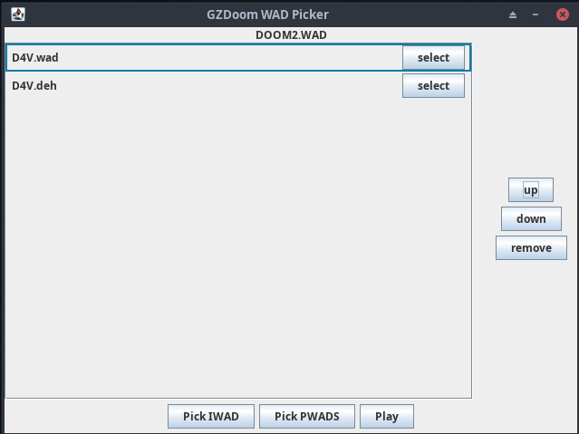

# sl-gzdoom-wad-picker
A custom GZDoom launcher made with Java

### build

It was made using IntelliJ Idea (Community Edition), so I would recommend using that. However, there are other methods of building Java projects and it shouldn't be that hard since you only need the contents of the `src` folder and there aren't too many files.

When running it from the command line you can pass the path to your Doom WAD directory as an argument. This will set the starting directory for the file browser for that sesssion, otherwise it will open in your home directory. As of a few commits ago the `jar` file is included in the repo and so an example command would be:
```
java -jar sl-gzdoom-wad-picker.jar ~/Documents/WADS
```

Tested on Arch Linux with Java 17 and 21.

### screenshot(s)



### features and reasons

I don't like drag-and-drop that much and I don't really use the other options from the official GZDoom launcher either, so I made a small launcher that makes it easier to select WADs. It is...

- able to select PWADs without having to drag-and-drop them from your filesystem (you can select multiple in the file selection window by holding down the `ctrl` or `shift` keys)
- able to remove PWADs or change their loading order

### todo

- [ ] test on other platforms
	- [ ] Windows
	- [ ] general Linux build?
- [ ] create and save configs
- [ ] create file filter to only show `wad`, `pk3`, and `deh` files 
- [ ] make it prettier
- [ ] add build and install script
- [ ] maybe add other GZDoom launch options (Vulkan vs. OpenGL, Fullscreen, etc)